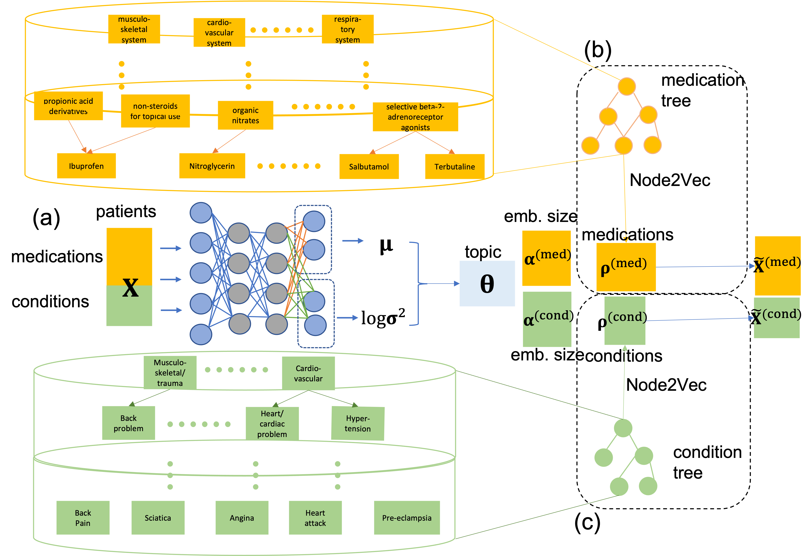

# GETM: Graph Embedded Topic Model
A generative model that intergrates embedded topic model and node2vec.

The detailed description and its application on UK-Biobank could be found [here](https://www.biorxiv.org/content/10.1101/2022.01.07.475444v1)

## Contents ##
- [Contents](#contents)
	- [1 Model Overview](#1-model-overview)
	- [2 Usage and Running Examples](#3-usage-and-running-example)
	- [3 References](#4-references)

## 1 Model Overview

**(a)** GETM training. GETM is a variational autoencoder (VAE) model. The neural network encoder takes individuals' condition and medication information as input and produces the variational mean μ and variance σ<sup>2</sup>> for the patient topic mixtures **θ**. The decoder is linear and consists of two tri-factorizations. One learns medication-defined topic embedding **α**<sup>(med)</sup> and medication embedding **ρ**<sup>(med)</sup>. The other learns condition-specific topic embedding **α**<sup>(cond)</sup> and the condition embedding **ρ**<sup>(cond)</sup>. We separately pre-train **(b)** the embedding of medications **ρ**<sup>(med)</sup> and **(c)** the embedding of conditions **ρ**<sup>(cond)</sup> using node2vec based on their structural meta-information. This is done learning the node embedding that maximizes the likelihood of the tree-structured relational graphs of conditions and medications.

## 2 Usage and Running Examples
### Data format
* The getm takes a bag-of-words individual-by-med+cond numpy matrix, a medication embedding matrix and a condition embedding matrix.
* node2vec requires a text file with format as: *node1* *node2*.

### Command examples
* **Get node embedding with node2vec**
```python
import networkx as nx 
from node2vec import Node2Vec
# Get groph using text file
G = nx.read_edgelist(graph_file, nodetype=int, create_using=nx.DiGraph())
for edge in G.edges():
    G[edge[0]][edge[1]]['weight'] = 1
G = G.to_undirected()
# Run node2vec
node2vec = Node2Vec(G, dimensions=dimensions, walk_length=walk_length, \
                   num_walks=num_walks, workers=workers)
```

* **Commands to run getm**
	* Run getm without masking test information
	> `	python main_multi_etm_sep.py --epochs=10 --lr=0.01 --batch_size=100 --save_path="acute2chronic_results/results_m802c443_topic128"\
	 --vocab_size1=802 --vocab_size2=443 --data_path="data/drug802_cond443" --num_topics=128 --rho_size=128 --emb_size=128 --t_hidden_size=128 --enc_drop=0.0 \
	 --train_embeddings1=0 --embedding1="drug_emb.npy" --train_embeddings2=0 --embedding2="code_emb.npy" --rho_fixed1=1 --rho_fixed2=1`
	 
	 `-vocab_size1`: number of unique medication<br/>
	 `-vocab_size2`: number of unique condition<br/>
	 `-train_embedding1`: whether to initialize medication embedding randomly<br/>
	 `-train_embedding2`: whether to initialize medication embedding randomly<br/>
	 `-embedding1`: path for pretrained medication embedding<br/>
	 `-embedding2`: path for pretrained condition embedding<br/>
	 `-rho_fixed1`: whether to fix medication embedding during training<br/>
	 `-rho_fixed2`: whether to fix condition embedding during training<br/>

	 * Run getm with partial test information masked
	 > `python main_multi_etm_rec.py ...`


## 3 References
<a id="1">[1]</a>
Aditya Grover and Jure Leskovec. node2vec: Scalable feature learning for networks.
CoRR, abs/1607.00653, 2016.


